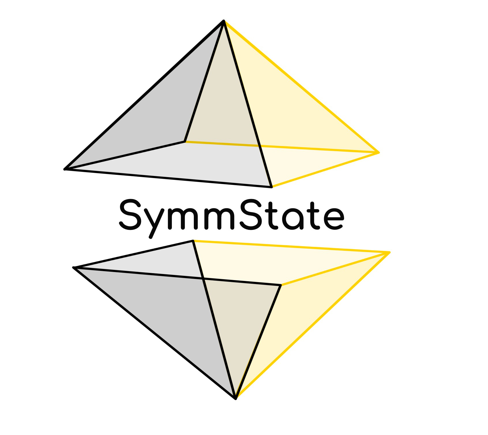

# SymmState

Applications of symmetry in solid state physics 

## Overview

SymmState is a powerful Python package designed to calculate and analyze various symmetry applications within solid-state physics, such as flexoelectric and piezoelectric properties of materials. This package provides seamless interaction with Abinit, allowing users to conduct sophisticated simulations and analyses directly from Python. The package builds off of the many Pymatgen objects for extended functionality. 

## Installation

To install the SymmState package, follow these steps:

1. Clone the repository into a directory (name of directory is arbitrary):
    ```bash
    mkdir symmstate_program
    cd symmstate_program
    ```

2. Place the `SymmState` package files into the `symmstate_program` directory.

3. Install the package using pip:
    ```bash
    pip install .
    ```

This will install all necessary dependencies for SymmState and make it ready for use.

## Features

- **Symmetry Analysis**: Perform advanced symmetry analysis on solid-state materials.
- **Flexoelectric Properties**: Calculate flexoelectric properties for various materials and their evolution under particular perturbations.
- **Piezoelectric Properties**: Evaluate the piezoelectric response of various materials and evolution under particular perturbations.
- **Abinit Integration**: Interact seamlessly with Abinit for simulations.
  
## Future Features

- Extended Abinit interaction and functionality
- Automation of the calculation of symmetry informed phonon dispersion curves
- Extended interaction to Vasp through pymatgen
- Convergence of files using Abinit and Vasp

*More features coming soon!*

---

Feel free to explore and contribute to the development of SymmState as we continue to expand its capabilities for the scientific community interested in solid-state physics.

For any questions or feedback, please don't hesitate to reach out to us at the email isacvillages@gmail.com.
